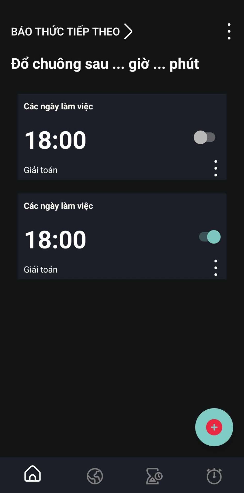

# WakeUp

WakeUp is a an Android alarm clock application developed in Java using Android Studio. It is designed to help users wake up on time by providing various challenges or tasks that must be completed before the alarm can be turned off. These challenges are meant to ensure that the user is fully awake before disabling the alarm. This repository contains the source code and necessary files to run the WakeUp application.

## Screenshots




## Features

- **Multiple Alarm Options**: Set multiple alarms for different times and days.
- **Challenge Modes**: Choose from a variety of challenges to solve before the alarm stops ringing, such as solving math problems, shaking the phone vigorously, or taking a photo of a specific object.
- **Customizable Settings**: Customize alarm tones, snooze durations, and challenge difficulty levels to suit individual preferences.
- **Sleep Tracker**: Monitor your sleep patterns and set alarms accordingly to ensure a more restful wake-up experience.
- **User-Friendly Interface**: Intuitive user interface for easy navigation and alarm management.

## Installation

Follow the steps below to set up the project:

1. Clone the repository to your local machine.
2. Open the project in Android Studio.
3. Build and run the app on your Android device or emulator.
4. Set alarms, configure settings, and start waking up with challenges!

## Contributing

Contributions to WakeUp are always welcome. If you would like to contribute, please follow these steps:

1. **Fork the repository.**
2. **Create a new branch:**

    ```bash
    git checkout -b my-new-feature
    ```

3. **Make your changes and commit them:**

    ```bash
    git commit -m "Add some feature"
    ```

4. **Push to the branch:**

    ```bash
    git push origin my-new-feature
    ```

5. **Open a pull request and provide a detailed description of your changes.**

Please make sure to adhere to the code style and conventions used in the project.

## License

The WakeUp is licensed under the [MIT License.](https://choosealicense.com/licenses/mit/)
## Contact

If you have any questions, suggestions, or feedback, please feel free to contact the project maintainer at:

[](https://portfolio.codewithdt.com/)
[](https://www.linkedin.com/in/dduythai/)
[](https://www.youtube.com/@codewithdt)
[](https://www.facebook.com/duythai.ddt/)
[](https://www.instagram.com/dduy_thai/)
[](https://twitter.com/codewithdt)

 
